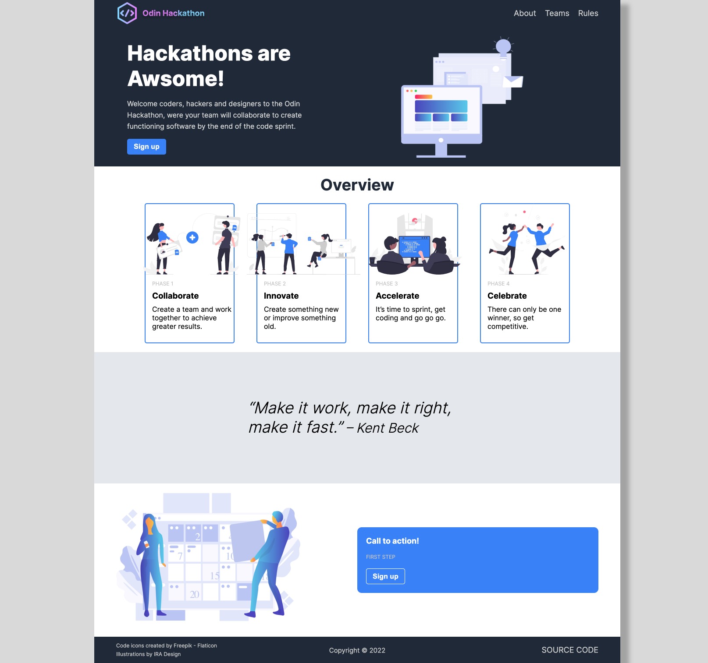

# Project: Landing Page

A simple landing page created from the [template](https://cdn.statically.io/gh/TheOdinProject/curriculum/81a5d553f4073e593d23a6ab00d50eef8620796d/foundations/html_css/project/imgs/01.png) in the resources folder.

The focus is on good semantic html layout and basic css to create a clear and concise landing page for a collaboration Hackathon.

---

 